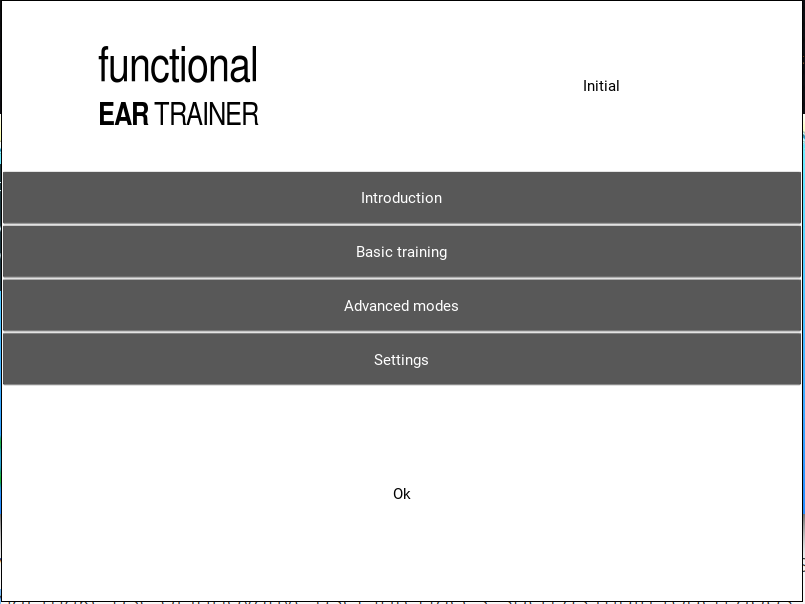

# Functional Ear Training

We aim to build a open source version of [Alain Benbassat method](http://www.miles.be/software) of ear training. Also [this Android app](https://play.google.com/store/apps/details?id=com.kaizen9.fet.android) implements his method.

We aim to be using [Kivy](https://kivy.org) and focus in portability; is a simple app, so, no excuses to not keep it portable.

**KIVY**: [API Reference](https://kivy.org/docs/api-kivy.html) | [Getting Started](https://kivy.org/docs/gettingstarted/intro.html) | [KV lang](https://kivy.org/docs/guide/lang.html)

Some of our design ideas are on [DESIGN.md](DESIGN.md). Also, let us try to separate backend from frontend so that the backend may be reused as library.

## other notes

Would be great if someone could write this to a HTML5 webapp too. Maybe later..

## What is coming to life?

## Dependencies

* python 3.5
* kivy
* lds2
* configobj
* that for rst rendering, preferably try using something else.

## Jupyter nootebooks

[midi-wav-midi2audio-music21](https://iacchus.github.io/jupyter-notebooks/html/midi-wav-midi2audio-music21.html)
